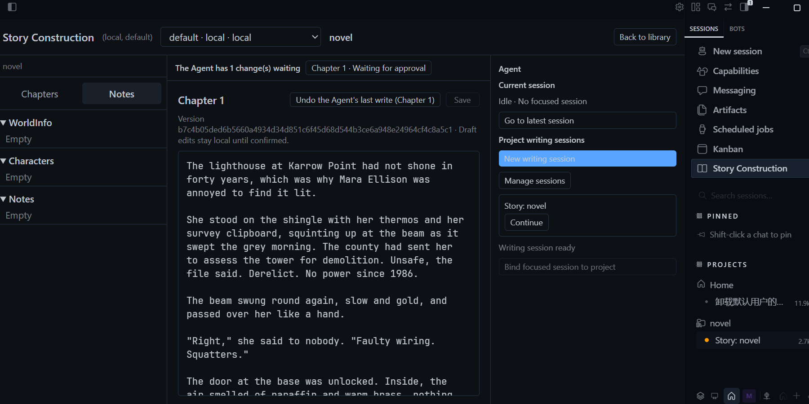
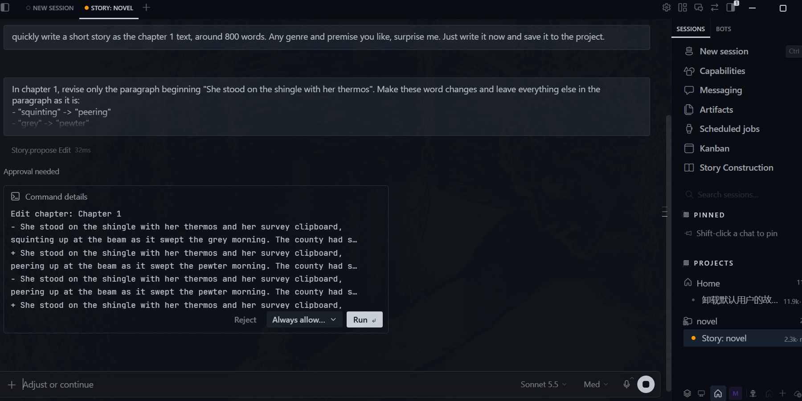
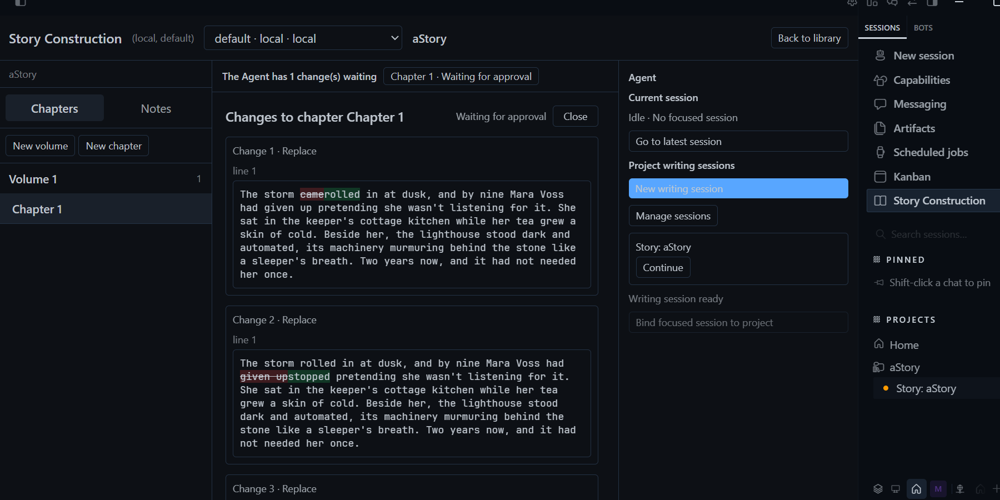

# Story Construction for Hermes

Write long-form fiction with a Hermes agent that keeps your canon straight.
Your story lives in an [Obsidian](https://obsidian.md) vault as plain Markdown;
the plugin adds a project workspace to Hermes Desktop and gives the agent tools
to read your world, characters and chapters.

**The agent proposes, you decide.** It never edits your story on its own. Every
change arrives as a proposal you can read as a diff in the Story panel, and you
approve it in the chat with Hermes' own approval prompt. Only what you approved is
written, and **Undo** restores the text from before the agent's last write.
Your own draft of a chapter is saved only when you confirm Save.

## Vault format

Your story is stored as plain Markdown files with YAML frontmatter, in a folder
layout this plugin defines (projects, world info, characters, notes, volumes and
chapters; see "Project Markdown contract" below). The [Obsidian](https://obsidian.md)
app is **not required**: the plugin reads and writes the files itself, so any
folder works as the vault. Obsidian is simply a good way to browse and edit the
same files, and the plugin follows Obsidian-style Markdown. Projects are
created from inside the plugin; importing an existing vault of your own notes is
not something it has been tested for.

## What you get

- **Project-first workspace** in the Desktop sidebar: create and pick story
  projects, see only that project's writing sessions, open chapters in an editor.
- **Canon-aware agent**: it can look up world info, characters, volumes and
  chapters, and search your notes and reference notes before it writes.
- **Reviewable edits**: new records, edits, renames and deletes all go through
  proposals with a diff preview.
- **Plain files**: everything is Markdown in your vault, so you keep full
  ownership and can use Obsidian alongside it.

## Screenshots

**Project workspace**: chapters, world info, characters and notes on the left,
the open record in the middle (here a character card the Agent wrote), the
writing sessions on the right. *Undo the Agent's last write* sits at the top.



**The Agent proposes, you approve in the chat**: Hermes' own approval prompt
shows the record and what changes.



**Read the diff**: the Story panel shows each proposed change with the
differences highlighted. Approval itself happens in the chat.



## Quick start

Requires Hermes `>=0.21.5` and Hermes Desktop.

```text
hermes plugins install mzyas/hermes-agent-story-construction-plugin --enable
```

The plugin is at the repository root. Once it is listed in the Hermes plugin
catalog, `hermes plugins install story-construction` will work as well.

Then enable the Desktop half in **Capabilities → Plugins**, open **Story** in the
sidebar, choose your Obsidian vault and writing Profile, and create a project.
If your writing Profile is not `default`, install into both; see "Install and
configure" below. Install and run exactly one backend (Windows or WSL, not both).

## Acknowledgements

- [OpenFic](https://github.com/syrizelink/OpenFic) - inspiration for the
  project-library-first workflow. No code or assets were copied.
- [SillyTavern](https://github.com/SillyTavern/SillyTavern) and
  [oh-story-claudecode](https://github.com/worldwonderer/oh-story-claudecode) -
  also acknowledged by OpenFic, whose approach informed this plugin.

## Privacy and behavior disclosure

The plugin makes no calls to third-party services, runs no shell commands or
background processes, stores no credentials and sends no telemetry. What it does
touch on disk:

- **Your Obsidian vault**: reads project records; writes only what you approve
  or confirm, and "deleted" records move to `<Vault>/.story-trash/`, never erased.
- **Hermes home** (`plugin-data/story-construction/`): session bindings,
  proposals and undo history.
- **Hermes `config.yaml`**: the setup step writes only this plugin's own
  settings keys (selected Profile, vault path).
- **A workspace folder per project** (`<terminal.cwd>/story/<project id>/` or
  `<Profile home>/story-workspaces/<project id>/`) so sessions group under a
  Hermes project.
- **Local Dashboard API** under `/api/plugins/story-construction/`, used only
  by the Desktop half.

License: Apache License 2.0.

---

# Technical reference

This unified plugin provides the backend and native Desktop halves of the story
construction workspace. The Desktop half contributes a project-first page in
the left navigation: it creates and selects projects, lists only the selected
project's writing sessions, opens chapters in the editor, and keeps manual
focused-session binding as a secondary action. Renderer code never scans or
writes the Vault.

## Install and configure

The plugin installs from this repository into two places: the
default home hosts the Dashboard API half, and each writing Profile hosts its
Agent half. Both installs are full copies of the same repository, because each
half needs the `story_construction_plugin/` package: the Dashboard API loads it
from the default home as its backend library, and the Gateway loads it from the
Profile to register the Story tools. If the writing Profile is `default`, one
install serves both halves.

```text
hermes -p default plugins install mzyas/hermes-agent-story-construction-plugin --enable
hermes -p writer plugins install mzyas/hermes-agent-story-construction-plugin --enable
```

The two copies must be identical. Selecting or resolving a writing Profile is
rejected with `version_mismatch` when the two `plugin.yaml` versions differ, or
when the package sources differ: a SHA-256 over the paths and contents of
`story_construction_plugin/**/*.py` and `story_construction_plugin/skills/**/SKILL.md`
(`__pycache__` and CRLF versus LF line endings are ignored). Other files, such
as `dashboard/` and `desktop/`, are not part of that comparison. A copy whose
`story_construction_plugin/` folder is missing, empty, or unreadable is rejected
with `agent_not_installed`; two missing copies never count as identical. The
digest is cached per copy and recomputed only when a file's size or
modification time changes.

This check compares the copies **on disk**. It does not prove that the running
Dashboard or Gateway executes that code: both load the package once, so after
an update they keep running the old code until they are restarted (see below).

#### Updating the plugin

Update both copies every time, then restart the Dashboard:

1. Update the default home copy: `hermes -p default plugins update story-construction`
   (or reinstall it with the command above).
2. Update each writing Profile copy the same way, with `-p <profile>`.
3. Restart the Dashboard. Hermes mounts the Dashboard API only at startup, so a
   running Dashboard keeps serving the old code and a frontend retry cannot pick
   up the new one.
4. Start a new chat session so it is built with the updated tools.

`hermes plugins update` exists in the Hermes CLI, but it has not been run against
an install of this plugin; if it fails or reports nothing to update,
reinstall with the install command instead.

Updating only one copy makes the next status call return `version_mismatch`
until the other one is brought up to the same code. The reverse is not true: a
passing check after updating both copies does not mean the running Dashboard
already uses the new code, so the restart in step 3 is still required. Check the installed version
in `plugin.yaml` if you are unsure which copy is behind.

The shared Vault path must be a path that the backend process can read and
write, for the operating system that backend runs on. It can be changed later by submitting a new `vault_root` to
`PUT /settings` (Desktop: "Change Vault path" in the project library); the new
path replaces the old one and existing session-to-project bindings are cleared,
because they refer to projects of the previous Vault. The first Dashboard API mount
may need the normal dashboard reload to pick up the plugin; switching between
already prepared Profiles does not.

The Agent tools are always registered when the plugin loads, but each session
decides whether it sees them when it builds its tool list. A selection saved
after the plugin loaded therefore applies to sessions created afterwards; a
session that was already open keeps the tools and prompt it started with, so
start a new chat session. No restart is needed for a settings change. A restart
is only needed after updating the plugin code, because the plugin loads once.

#### Windows and WSL Vault paths

Windows and WSL each have their own Hermes home and `config.yaml`, so a backend
stores the Vault path in its own native spelling. A drive path written by the
other side is translated when it is read: on Windows `/mnt/e/Vault` is opened as
`E:/Vault`, and in WSL `E:/Vault` or `E:\Vault` is opened as `/mnt/e/Vault`. This
covers drive-letter paths only; UNC paths such as `\\wsl.localhost\...` are not
translated. `locked_hermes_home` is deliberately not translated, so a home
written by the other side is still rejected with `hermes_home_mismatch`.

Limits of the translation:

- Only absolute drive paths (`E:`, `E:/...`, `E:\...`) are translated. A
  drive-relative path such as `E:Vault` is left unchanged and is not a usable
  Vault path in WSL; always write the Vault path with a slash after the colon.
- WSL drives are assumed to be mounted under `/mnt/<letter>`. A custom
  `automount.root` in `/etc/wsl.conf` (for example drives under `/`) is not
  recognised.
- The saved path is the resolved path. On Windows, resolving a mapped network
  drive yields its UNC form (`\\server\share\...`) and a `subst` drive yields
  its target drive, so the stored value may not be a drive-letter path that
  the other side can translate. Re-enter the Vault path with `PUT /settings`
  after moving sides in that case.

Locks: `sessions.json` keeps its file lock because the Dashboard API and the
Gateway are separate processes on one home. The Vault has no file lock. A lock
taken on Windows and one taken in WSL do not see each other on a shared drive,
so the Vault relies on atomic `os.replace` writes and version-checked saves
(`SaveConflict`).

Install and run exactly one backend. Do not install or enable this plugin in both
Windows and WSL, and never let two backends write the same Vault: the Vault has
no cross-system lock, so concurrent writes from both sides are unsupported and
may lose data. If you move to the other side, remove or disable the plugin on
the old side first, then run `PUT /settings` on the new one. The path
translation above exists so a single backend can accept a path typed in the
other spelling, not to support two backends at once.

Verification status:

- Verified: the string translation in both directions, run on every OS through
  `translate_vault_text(value, os_name)` in `tests/test_paths.py` (drive letter
  case, trailing slashes, `E:` alone, `/mnt/ee` and `/mnt/wsl` not read as
  drives, spaces and non-ASCII, `E:foo`, backslashes in a POSIX path left alone),
  and the full suite (538 passed, 1 skipped) on Windows, including the code-drift
  check between the two installed copies (setup and per-request paths, missing
  and unreadable packages, digest caching) and a `/mnt/<drive>/...` Vault path
  stored in config being accepted by `resolve_story_target` and the runtime.
- Not yet verified: opening a translated path on a real WSL filesystem
  (`native_vault_path` in WSL; its test is skipped on Windows and has not run in
  WSL); a Vault reached through `\\wsl.localhost\...`. Two backends
  writing one Vault is prohibited, so it is not a case to verify.

### Story setup and status API

Setup goes through the Dashboard API under `/api/plugins/story-construction/`:

```text
PUT  /settings                                      select Profile and shared Vault
GET  /status                                        readiness and diagnostics (never the Vault path)
POST /projects                                      create a project in the shared Vault
DELETE /projects/{project_id}?confirm_name=             move a project to the Vault trash
POST /projects/{project_id}/workspace                 create or reuse the project's workspace folder
GET /projects/{project_id}/workspace                  the project's Hermes project link
PUT /projects/{project_id}/workspace/link             remember the Hermes project for that folder
POST /projects/{project_id}/volumes                  append a volume to a project
POST /projects/{project_id}/volumes/{volume_id}/chapters   append an empty chapter to a volume
POST /projects/{project_id}/sessions                bind a Hermes session to the project
GET  /projects/{project_id}/sessions                list the project's bindings
DELETE /projects/{project_id}/sessions/{stored_session_id}    remove a binding
POST /projects/{project_id}/chapters/{chapter_id}/save        confirmed chapter save
GET  /projects/{project_id}/records/{character|world_entry|note}/{id}   one record with its text (read-only)
GET  /projects/{project_id}/proposals               the Agent's open proposals, with their diff
DELETE /projects/{project_id}/proposals/{id}        discard a proposal
POST /projects/{project_id}/chapters/{id}/undo      restore the text from before the Agent's last write
                                                    (body `target_type` names another kind of record)
GET  /projects/{project_id}/writes                  the Agent's recent writes
```

`PUT /settings` is the only configuration write. It runs the scoped selection
transaction and updates only the Story settings keys shown below; requests
never supply a Hermes home path. Chapter saves keep the confirmed-save rules
from “Draft and save behavior”: explicit `confirmed: true` plus the chapter's
`expected_version`, rechecked immediately before the atomic Obsidian
replacement.

Actionable codes from setup and status:

| Code | Meaning |
| --- | --- |
| `profile_not_selected` | Nothing selected yet; call `PUT /settings` first. |
| `profile_invalid` / `profile_not_found` | The Profile name is invalid or not a prepared Hermes Profile. |
| `configuration_incomplete` | A partial selection; provide the missing settings field. |
| `managed_config` | Hermes manages this config; Story will not write it. |
| `config_invalid` / `config_write_failed` | The target `config.yaml` cannot be read or written. |
| `agent_not_installed` / `agent_name_mismatch` / `version_mismatch` | A plugin copy (or its `story_construction_plugin/` package) is missing or unreadable, misnamed, or its `plugin.yaml` version or package sources differ from the default copy. |
| `agent_not_enabled` | The target Profile does not have `story-construction` enabled. |
| `vault_not_directory` / `vault_unwritable` / `vault_mismatch` | The shared Vault path is not a directory, is read-only, or the stored target and shared Vault settings disagree and no new `vault_root` was submitted. |
| `vault_unavailable` | The Vault could not be opened as a Story repository. |
| `hermes_home_mismatch` / `runtime_home_unavailable` | The process home does not match `locked_hermes_home`. |
| `profile_switched` | The selection changed during a write; retry the request. |
| `binding_state_invalid` | `sessions.json` is malformed or alias-conflicting; repair or remove it to recover. |
| `profile_lock_mismatch` / `permission_denied` | The request scope leaves the locked Profile or the bound session's project. |

### Config.yaml ownership

The selection transaction writes Story settings in exactly two homes:

```yaml
# default home config.yaml (Dashboard API side)
plugins:
  entries:
    story-construction:
      settings:
        selected_profile: "writer"
        vault_root: "D:/Obsidian/NovelVault"
```

```yaml
# target Profile home config.yaml (Agent side), e.g. profiles/writer
plugins:
  enabled:
    - story-construction
  entries:
    story-construction:
      settings:
        locked_profile: "writer"
        locked_hermes_home: "C:/Users/you/.hermes/profiles/writer"
        vault_root: "D:/Obsidian/NovelVault"
```

`locked_hermes_home` must be the canonical path returned by Hermes
`get_hermes_home()` within the selected Profile's bound scope. It identifies
the Story runtime's Profile home, not an exclusive Gateway process; do not
guess it from the display name. Every Story API and tool
scope must also exactly match `locked_profile`; a mismatch is rejected with
`profile_lock_mismatch`. The backend process must be able to read and write
the configured shared Vault.

### Durable session bindings

Durable binding state lives at
`<Profile home>/plugin-data/story-construction/sessions.json` in the selected
Profile's home — for example `profiles/writer/plugin-data/story-construction/sessions.json`
— not in the plugin installation tree. Every tool call re-reads this file: a
bind or unbind from the Dashboard API is effective for the very next Gateway
tool call without re-registering anything, and deleting or corrupting the file
denies the next call instead of falling back to stale state. Normal sessions do
not receive Story tools when the runtime is incomplete: the tools stay registered
but a readiness check hides them, and a call that still reaches a tool while the
runtime is not ready returns a structured error. Every tool and save still
requires the backend-authorized session-to-project binding.

### Writing Profile scope and Gateway deployment

Use Hermes' existing multi-profile Gateway deployment; a selected writing
Profile does not require a separate single-profile Gateway. Installation and
enablement in the writing Profile are separate from Gateway process ownership.
`locked_profile` and `locked_hermes_home` constrain the Story runtime and its
session bindings, not every Profile served by the Gateway. The YAML profile
label alone is not proof of authorization.

Full multiplex compatibility still requires real integration verification of
Profile-scoped plugin loading, tool dispatch, and A → B → A session isolation.
This deployment statement is not a claim that those checks have passed.

Enable the Desktop half separately in Capabilities → Plugins. The Desktop API
is mounted under `/api/plugins/story-construction/` and is reached only through
the namespace-scoped `ctx.rest` door. The Dashboard API has no trusted current
profile request context in this temporary arrangement: request `profile` values
must match `locked_profile` and any existing backend session binding, but are
not accepted as proof of identity. It rejects an uninitialized or invalid
runtime and exposes only non-sensitive status fields; the only configuration
it ever writes are the Story settings keys above, through the scoped setup
transaction.

The Desktop half uses the selected writing Profile's Hermes sessions without
requiring a dedicated Gateway process. Its normal project-first workflow is:

```text
Create project → initialize Obsidian skeleton → create and bind Hermes session
→ open an empty chat → user writes first → Agent decides story work or plain chat
→ choose chapter/goal in chat → continue the bound session
```

Project creation does not require a focused chat. The backend initializes the
Obsidian project, world, first volume, and first chapter; “New writing session”
then creates a Hermes session that follows the locked Profile configuration,
binds it on the backend, and opens it as an empty chat. No first task is
sent. The Agent judges from the user's own words whether they want story work
or just a chat; for story work it calls `story.get_session_project`, which
returns the project bound to that session (the model cannot name another
project), then confirms the chapter title, goal, and output scope as before.
An unbound session gets `session_not_bound` and stays an ordinary chat. If a
durable binding points to a deleted Hermes session, “Continue”
shows “Remove stale binding”; removal occurs only after that explicit action.

The panel shows the focused session by its Hermes name (what the Hermes sidebar
shows), and a focused session that is already bound shows “Bound · name”
instead of the bind button. “Manage sessions” is the only way to delete:
rows then get checkboxes and a Delete button, with Select all and Delete
selected on top. Every deletion asks for confirmation first. The default is
“Remove binding”, which keeps the Hermes session so it can be bound again;
ticking “Also permanently delete the session itself” calls Hermes
`session.delete` and then removes the binding. The session currently open
cannot be permanently deleted, because Hermes refuses it.

Story sessions open with Hermes' `tab` intent. A session that is already on
screen is only focused, so the project page keeps its place; one that is not
opens as a tab in the centre zone and covers the page. Hermes gives plugins no
way to dock a session to the side, so a lasting side-by-side layout is something
you set up yourself: drag the session tab to the right edge once. Hermes
remembers that layout, and “New writing session”, “Continue” and “Go to latest
session” then focus that tile instead of covering the page. Clicking an
unrelated session in the Hermes sidebar still loads it into the main area and
replaces the page; click the Story entry to bring the page back.

### Hermes projects and workspace folders

Hermes groups sessions into a Hermes project by their working directory, so
each Story project gets its own folder and a Hermes project around it. Without
this, every writing session lands loose in the Hermes sidebar.

- **Folder**: `<terminal.cwd>/story/<project id>/` when the writing Profile's
  `config.yaml` has an absolute `terminal.cwd` that exists on a local terminal.
  Otherwise `<Profile home>/story-workspaces/<project id>/`. A Profile whose
  terminal backend is `ssh` keeps its directory on another host, so no folder
  is created for it and sessions are opened as before.
- **Not the Vault**: Vault records are only written through tools and the
  Desktop UI. The workspace folder is separate; it is where a session can keep
  its own files.
- **Who creates it**: the plugin backend, on the machine that serves the
  connection, because Hermes only registers a folder and silently ignores a
  `cwd` that does not exist. With the WSL backend that is the WSL filesystem
  (reachable from Windows as `\\wsl$\...`), the same place the gateway checks.
- **When**: right after a project is created, and again when a writing session
  is opened (so projects made earlier are picked up). The folder, the Hermes
  project (`projects.create`, or the existing one that already owns the
  folder) and the link in `plugin-data/story-construction/workspaces.json` are
  all reused when they exist. A failure never blocks the session; the panel
  says the session was not grouped and why.
- **Sessions**: `session.create` is given the folder as `cwd`, and the result
  is checked, because an unusable `cwd` would otherwise be dropped silently.
  Existing sessions keep their old directory.
- **Deleting a project** archives its Hermes project (`projects.archive`, so it
  can be restored) and leaves the workspace folder untouched.

### Deleting a project

Each card in the project library has a “⋯” menu with “Delete project”. The
dialog shows the volume and chapter counts and how many writing sessions are
bound to the project, and the project name has to be typed before the button
enables. The backend checks the typed name too (`confirm_name`).

Nothing is erased: the whole project folder is renamed into
`<Vault>/.story-trash/<folder>-<timestamp>/`, which the record scan ignores, so
the name can be used again and the folder can be moved back by hand. Every
session binding to that project is dropped; the Hermes sessions themselves stay.
There is deliberately no permanent delete — empty `.story-trash` yourself.

### Project workspace

Leaving the Story page and coming back resumes the project last opened for that
connection and Profile (kept in memory and in `localStorage`); “Back to library”
forgets it, and a remembered project that no longer exists falls back to the
library.

The left sidebar has two tabs. “Chapters” lists each volume as a group with its
chapter count and its chapters beneath it; “Notes” holds the world info,
characters, and notes. “New volume” and “New chapter” (a chapter goes into the
open chapter's volume, else the last volume) open an inline title field;
Enter creates, Escape cancels, and Enter that confirms an IME candidate is
ignored. The new volume or chapter is a new Markdown record
(`volumes/volume-NNN.md`, `chapters/chapter-NNN.md`) with the next free
`<project>:volume-N` / `<project>:chapter-N` ID; an existing file is never
overwritten, titles are trimmed and limited to 120 characters without control
characters, and a failed request shows generic copy rather than the raw error.

Right-clicking a volume, a chapter, or the empty space below the list opens a
menu. Its entries are registered data (`registerStoryMenuItem({ id, kinds,
labelKey, order, when, disabled, run })`, with `kinds` drawn from `sidebar`,
`volume`, and `chapter`), so a later feature adds an entry without touching the
sidebar. The menu uses the Desktop SDK's context-menu components and is simply
absent on an SDK that lacks them; the toolbar buttons still work.

## Project Markdown contract

The backend recognizes Markdown files with YAML frontmatter records:

```text
Project → WorldInfo (0..1) → WorldInfoEntry (0..many)
        → Character (0..many)
        → NoteCategory (0..many; at most two levels) → Note (0..many)
        → Volume (at least one) → Chapter (0..many)
```

IDs and relationship fields are authoritative. A chapter stores both
`project_id` and `volume_id`; its `source_ref` and content hash provide the
optimistic version used during save. Worldbook, character, note, and chapter
bodies are loaded through project-scoped repository methods and Story tools,
not from arbitrary paths supplied by the model.

## Agent and prompt boundaries

The normal Hermes loop is preserved:

```text
Session input
  → Hermes stable system prompt + StoryConstructionAgentPrompt v1
  → canonical Session history + current turn
  → LLM call
  → story.* / skill_view tool call
  → session/project permission check
  → scoped Markdown query
  → ToolMessage
  → next LLM call
  → chapter draft
```

The main template is registered through Hermes'
`register_system_prompt_section()` seam. It is rendered once when a bound Story
session is created and remains byte-stable across requests. Request assembly
still includes that stable System Prompt on every LLM request so Hermes and the
provider can reuse their prompt-cache prefix. Neither template is written back
to Session history. Live project records and Skill bodies arrive through the
normal tool-result path.

`StoryWorkerPrompt v1` is a separate fresh child context. A child receives only
the explicit project/chapter goal, selected Skill guidance, and validated source
references; it is read-only and has no chapter-save or proposal operation. The main Agent is
the only synthesizer.

## Draft and save behavior

Generated chapter output is a local Draft first. Saving requires an explicit
confirmation checkbox and sends the session/profile/connection, project/chapter
IDs, and expected content version. The backend rechecks Desktop permission and
the version immediately before the atomic Obsidian replacement. A conflict
returns both the current chapter and generated draft for review; it never
silently retargets or overwrites the newer file.

## Proposals (how the Agent writes)

The Agent never writes on its own. It proposes, you approve, then it applies
exactly what you approved. This covers **chapters, characters, world info
entries and notes**; each proposal targets one of them (`target_type`:
`chapter` by default, `character`, `world_entry`, `note`).

1. **Propose** — `story.propose_edit` (changes to the text of an existing
   record) or `story.propose_new` (a new chapter at the end of a volume, or,
   with `target_type`, a new character, world entry or note). A proposal stores
   a list of edits; no Vault file is touched. Edits are `replace`
   (`old_text` → `new_text`, empty to delete), `insert_after` / `insert_before`
   (next to `anchor_text`), `append` / `prepend`, or a `rewrite` of the whole
   text (which must stand alone). Located text must appear once; if one edit
   cannot be placed the whole proposal is rejected and the Agent is told why.
   Matching is exact first. If nothing matches exactly it tolerates what models
   routinely get wrong when copying: curly vs straight quotes, dash and space
   variants, and trailing blanks. Full-width CJK punctuation is never folded to
   half-width, and a text that still matches more than once is refused.
2. **Finding the record** — `story.list_records` lists the characters, world
   entries or notes (id, title, version, length; never the text) and
   `story.get_record` reads one. A record can be named by its id or by its exact
   title or name when that is unique; a name shared by several records is
   refused and the candidates are listed. The Agent is told to check that a
   record does not already exist before proposing a new one. Notes marked as
   references are read-only: they cannot be proposed for change, and a note
   that became a reference after you approved is not written.
3. **New records** — only the text is proposed; the title or name stays as
   given. A name already used by another record (a note only counts within its
   category) is flagged in red in the review, and when written it gets a number
   after it (`林远 (2)`) instead of replacing anything. `story.apply_edit`
   reports the final title. A new note may name an existing category, but the
   Agent cannot create categories.
   **Renaming and deleting** — `story.propose_rename` changes only a record's
   title or name (chapters, characters, world entries, notes; the text, id and
   file stay). `story.propose_delete` moves a character, world entry or note
   into the Vault's `.story-trash/records/` folder; nothing is erased, and
   **Undo** puts it back (it refuses if something now sits where it was). The
   Agent cannot delete chapters, and reference notes can be neither renamed nor
   deleted. Both are approved and applied like any other proposal, with nothing
   to select or edit. A deletion is always “high risk” in the chat prompt, so
   “always allow” never skips it.
4. **Body only** — `new_text` / `content` is only the record's text. A wrapping
   code fence is removed, frontmatter is refused, and an introduction
   (“好的…”, “Here is…”), a closing remark (“希望…”, “Let me know…”) or a
   repeated heading is flagged in red in the review. Only the start and end of
   a text are inspected, so ordinary prose is never second-guessed.
5. **Review** — open proposals appear above the chapter editor. Each edit shows
   the changed paragraph with the character-level difference highlighted. The
   panel is for reading: you can close it or discard the proposal, but not
   approve it.
6. **Approve** — in the chat, bound to exactly what you approved. Only you can
   approve; the Agent's tools cannot. Right after proposing, the Agent calls
   `story.apply_edit`, and Hermes asks you to approve it in the conversation, the
   same prompt as any other tool, showing the record and what changes. Declining
   writes nothing, and the proposal is closed. If nobody answers, the prompt
   times out and nothing is written either; the proposal stays in the panel
   marked as expired, and asking the Agent to apply it again raises a fresh
   prompt.
   **Risky changes** (emptying a record, or removing about 800 characters, or 30%
   of a record of 100 or more) are marked “high risk” in the prompt and get a
   prompt rule of their own, so choosing *always allow* on a prompt never
   skips their review. Hermes' own settings still apply: if approvals are turned
   off there, nothing is asked.
7. **Apply** — `story.apply_edit` takes only a `proposal_id`, so it cannot
   write anything else. It refuses a proposal that is not approved, expired,
   already written, discarded or replaced, and it does not rely on the prompt
   having run: without the one-time grant the prompt hook leaves, it refuses
   to write. Approved edits are applied to the record as it is *now*: if you edited elsewhere in
   the meantime they still apply, and if an approved edit no longer matches
   nothing is written.
8. **Undo** — before every write the record's text is saved to
   `plugin-data/story-construction/history/` (the last 20 per record). “Undo
   the Agent's last write” restores it, but only while the record is still
   exactly as the Agent left it. A record the Agent created has no undo.

Proposals and approvals live in `plugin-data/story-construction/proposals.json`
(finished ones are kept for 7 days). Proposals saved before other record kinds
existed are read as chapter proposals. Deleting a project closes its open
proposals. The Desktop refreshes proposals every 5 seconds while the Agent is
working and every 30 seconds otherwise.

## Boundaries and non-goals

- No arbitrary filesystem access from the model or Renderer.
- No write to a chapter, character, world entry or note that the person did not see and approve; the Agent only proposes.
- No cross-machine Vault synchronization in the first version.
- Writing Profile bindings do not require a single-profile Gateway. Full multiplex integration remains to be verified; do not treat this declaration as a compatibility test result.
- A project switch should start or bind a new Story session; a chapter switch is
  dynamic turn context and does not mutate the stable prompt.
- The plugin uses Hermes built-in `skill_view`, plugin Skills, tool dispatch,
  `ToolMessage` continuation, and Desktop SDK REST/query primitives; it does
  not add a story-specific core tool or prompt-cache invalidation path.

## Verification

From this package directory:

```powershell
$env:UV_CACHE_DIR = "..\\.uv-cache"
.venv\Scripts\python.exe -m pytest -q
node --test desktop/*.test.mjs
```

To run the tests through uv, pass `--frozen` so uv uses `uv.lock` as written and
does not re-resolve or rewrite it:

```powershell
uv run --frozen --with pytest --with ruamel.yaml pytest tests -q
```

`pyproject.toml` sets `[tool.uv] exclude-newer = "14 days"`, so dependency
versions published in the last 14 days are not selected when the lock is
regenerated with `uv lock`.

The end-to-end test uses a temporary Vault and exercises the retrieval result,
ToolMessage-shaped continuation, prompt placement, confirmed save, frontmatter
preservation, and version update. The cross-process acceptance tests
(`tests/test_story_profile_processes.py`) additionally prove API-to-Gateway
binding propagation, A→B→A Profile isolation, restart durability, concurrent
API writers, and installer discovery — they spawn real worker processes
against temp homes and need the read-only Hermes source checkout pointed to by
`HERMES_SOURCE`. All tests create their own temporary Hermes homes and Vaults;
nothing here reads or writes a live installation.
